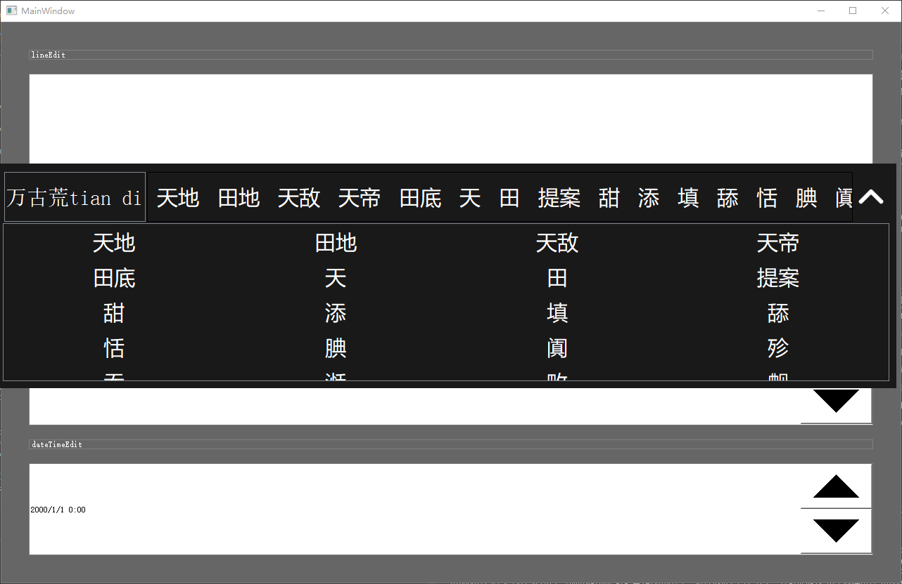
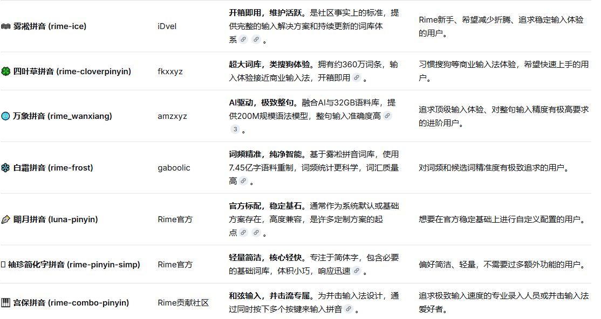

# InputMethod_rime

rime拼音自定义键盘, 词库第一次启动要初始化用户词库目录,有点慢, 打包程序要把基本词库和用户词库一起打包, 以免重新加载

### 运行截图

## windows编译

开发包链接 : https://github.com/rime/librime/releases/download/1.16.1/rime-de4700e-Windows-msvc-x64.7z

运行前需将源码目录下pinyin的rime-data(词库目录)和librime/lib/rime.dll复制到执行目录

# linux编译

1.拉取源代码

```
git clone --recursive https://github.com/rime/librime.git
```

2.安装依赖环境

```
bash action-install-linux.sh
```

3.安装boost

```
bash install-boost.sh
```

4.编译

```
mkdir build && cd build
cmake ..  -DENABLE_LOGGING=OFF  -DBUILD_TEST=OFF -DCMAKE_BUILD_TYPE=Release
make -j$(nproc)
```

头文件: librime/rime_api.h

库文件:librime/build/lib/librime.so.1.16.1

ldd查看库依赖, 将相关库和词库(pinyin/rime-data)一起打包

```
librime.so.1
libyaml-cpp.so.0.7
libleveldb.so.1d
libmarisa.so.0
libopencc.so.1.1
```

# 词库方案选型



以上词库方案皆可在github下载

## 朙月拼音 (luna-pinyin)

官方自带词库

## 雾凇拼音 (rime-ice)

词库比较好裁剪(总共50mb,裁剪后18.8 MB)

## 万象拼音 (rime_wanxiang)

基础词库有46MB,太大了

# 词库优化

当前使用的词库是将rime-ice的词库裁剪后所得

[GitHub - iDvel/rime-ice: Rime 配置：雾凇拼音 | 长期维护的简体词库 · GitHub](https://github.com/iDvel/rime-ice)[GitHub - iDvel/rime-ice: Rime 配置：雾凇拼音 | 长期维护的简体词库 · GitHub](https://github.com/iDvel/rime-ice)

1.如果拼音卡顿, 在文件rimeutils.cpp修改, 可以减少限制候选词量, 当前是1024个候选词上限

```
const int kMaxCandidates = 1024; // 数量上限
```

2.如果词库过大, 可以删除基础词库(只有单字表,没有词语表)

1. 删除rime-data/cn_dicts/base.dict.yaml

2. 在rime-data/rime_ice.dict.yaml将cn_dicts/base注释掉

   

   删除前主词库+用户词库大小为36.3 MB

   删除后主词库+用户词库大小为3.18 MB

# 替换词库

只需要将下载的词库替换为rime-data词库即可
