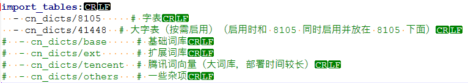

# InputMethod\_rime

rime拼音自定义键盘, 词库第一次启动要初始化用户词库目录,有点慢

## 运行截图


## windows编译

开发包链接 : <https://github.com/rime/librime/releases/download/1.11.0/rime-76a0a16-Windows-msvc-x64.7z>

因为ubuntu24.04安装的librime包为1.10版本, 版本差距过大api不一样,所以用相近版本

运行前需将源码目录下pinyin的rime-data(词库目录)和librime/lib/rime.dll复制到执行目录

## linux编译

安装librime开发包, 用ldd查看相关库一起打包, 头文件在`/usr/include/rime/rime_api.h`

官方词库在`/usr/share/rime-data`

```
sudo apt install librime-dev
```

## 词库优化

当前使用的词库是将rime-ice的词库裁剪后所得

[GitHub - iDvel/rime-ice: Rime 配置：雾凇拼音 | 长期维护的简体词库 · GitHubGitHub - iDvel/rime-ice: Rime 配置：雾凇拼音 | 长期维护的简体词库 · GitHub](https://github.com/iDvel/rime-ice)

1.如果拼音卡顿, 在文件rimeutils.cpp修改, 可以减少限制候选词量, 当前是1024个候选词上限

```
const int kMaxCandidates = 1024; // 数量上限
```

2.如果词库过大, 可以删除基础词库(只有单字表,没有词语表)

1. 删除rime-data/cn\_dicts/base.dict.yaml
2. 在rime-data/rime\_ice.dict.yaml将cn\_dicts/base注释掉

   

   删除前主词库+用户词库大小为36.3 MB

   删除后主词库+用户词库大小为3.18 MB

## 词库方案选型



以上词库方案皆可在github下载

### 朙月拼音 (luna-pinyin)

官方自带词库

### 雾凇拼音 (rime-ice)

词库比较好裁剪(总共50mb,裁剪后18.8 MB)

### 万象拼音 (rime\_wanxiang)

基础词库有46MB,太大了

## 替换词库

只需要将下载的词库替换为rime-data词库即可
